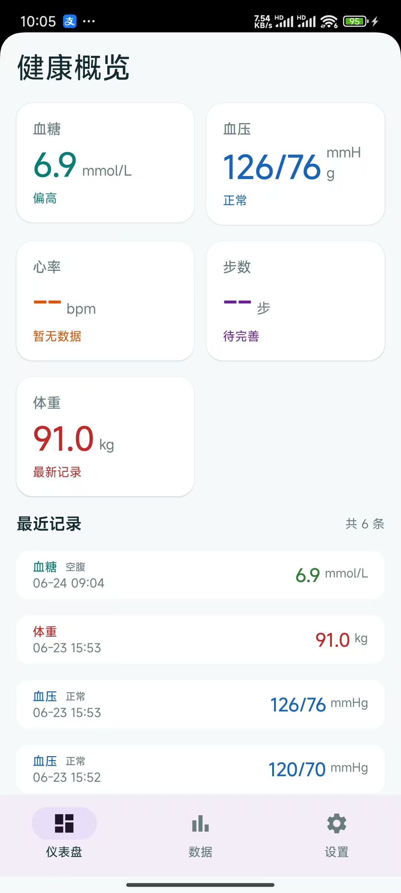
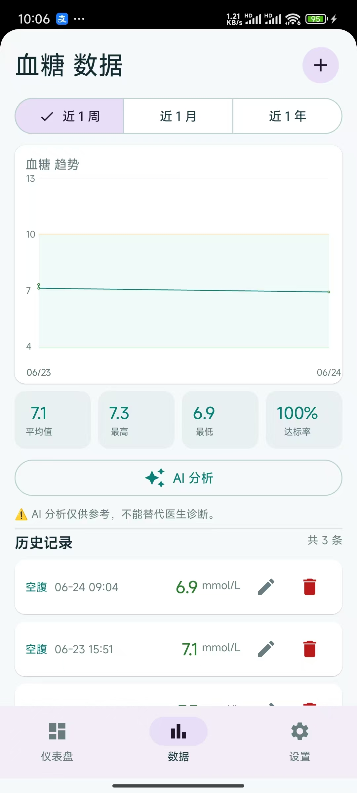
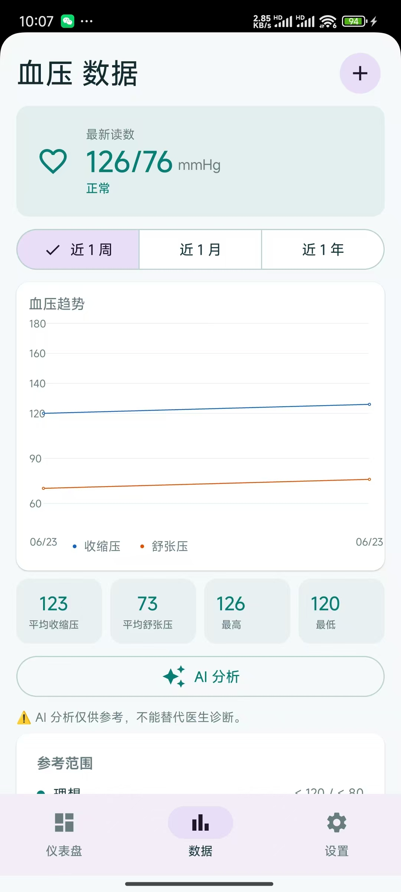

# 私人健康助手 (Health Tracker)

一款轻量级的 Android 健康数据追踪应用，支持血糖、血压、体重的记录、图表分析和云端同步。

## 功能特性

### 数据记录
- **血糖** — 记录血糖值、测量状态（空腹/餐后等）、备注
- **血压** — 记录收缩压/舒张压、脉搏、备注
- **体重** — 记录体重、身高（自动计算 BMI）、体脂率、备注
- 支持数据编辑、删除确认、新增时继承上一条记录的数值

### 图表与统计
- 每个指标支持 **1 周 / 1 月 / 1 年** 周期切换
- 血糖趋势图（带正常范围背景）
- 血压双线趋势图（收缩压蓝色 + 舒张压橙色）
- 体重趋势图
- 统计摘要：均值、最高、最低、达标率

### AI 分析
- 集成 LLM API（兼容 OpenAI 格式），一键分析健康数据趋势
- 分析结果 Markdown 渲染并内联展示
- **本地优先**，分析结果仅保存最新一条，同步至 WebDAV

### 仪表盘
- 概览卡片：最新血糖、血压、心率（从血压记录提取）、体重
- 混合时间线：按时间倒序展示所有指标的最新记录

### 数据同步
- 支持 **WebDAV 协议** 的云端备份与恢复
- **独立文件存储**：每条记录一个 JSON 文件，索引文件仅存 ID 列表
- AI 分析结果独立同步
- 双向冲突合并（按更新时间）

### 数据管理
- JSON 格式导入/导出
- 安全加密存储（密码和 API Key 使用 EncryptedSharedPreferences）
- Room 数据库，支持渐进式迁移

## 技术栈

- **语言**: Kotlin
- **UI**: Jetpack Compose + Material 3
- **架构**: MVVM (ViewModel + StateFlow)
- **数据库**: Room + KSP
- **网络**: OkHttp
- **图表**: 自定义 Canvas 绘制
- **存储**: EncryptedSharedPreferences
- **同步**: WebDAV (MKCOL + PUT + GET)

## 项目结构

```
app/src/main/java/com/healthassistant/
├── data/
│   ├── local/          # Room 数据库、DAO、迁移
│   ├── model/          # 数据模型 (GlucoseRecord, BloodPressureRecord, WeightRecord)
│   ├── repository/     # HealthRepository
│   └── sync/           # WebDAV 同步、AI 分析
├── ui/
│   ├── components/     # 通用组件 (图表、对话框、卡片、MarkdownText)
│   ├── dashboard/      # 仪表盘
│   ├── data/           # 各指标数据页 (GlucoseDataPage, BpDataPage, WeightDataPage)
│   ├── navigation/     # 导航路由
│   ├── settings/       # 设置页
│   └── theme/          # 主题、颜色、MaterialYou
├── util/               # 工具类 (SecurePrefs, ExportImport)
└── HealthTrackerApp.kt
```

## 截图

  

## 构建

```bash
git clone https://github.com/shiefzhang/health_assistant.git
cd health_assistant
./gradlew assembleDebug
```

最低 SDK: 26 (Android 8.0)  
目标 SDK: 35

## 配置

### AI 分析
1. 设置 → AI 配置
2. 填写 API 地址（兼容 OpenAI 格式，如 `https://api.openai.com/v1`）
3. 填写 API Key 和模型名称（如 `gpt-4.1-mini`）

### WebDAV 同步
1. 设置 → WebDAV 同步
2. 填写服务器地址、用户名、密码
3. 点击「立即同步」

#### 远程目录结构

每条记录独立存储为 JSON 文件，便于跨版本兼容和增量同步：

```
{webdavUrl}/
└── health-data/
    ├── glucose/             ← 血糖记录
    │   ├── {id}.json
    │   └── ...
    ├── weight/              ← 体重记录
    │   ├── {id}.json
    │   └── ...
    ├── bp/                  ← 血压记录
    │   ├── {id}.json
    │   └── ...
    └── analysis/            ← AI 分析结果（仅最新一条）
        ├── glucose.json
        ├── weight.json
        └── bloodPressure.json

{webdavUrl}/health-data.idx  ← 索引文件（仅存 ID + updatedAt）
```

每条记录 JSON 格式（以血糖为例）：
```json
{
  "id": "1782201106876",
  "value": 6.2,
  "measuredAt": "2026-06-23T08:30:00+08:00",
  "mealType": "空腹",
  "notes": "",
  "updatedAt": "2026-06-23T08:30:00Z",
  "deleted": false
}
```

## License

MIT License
